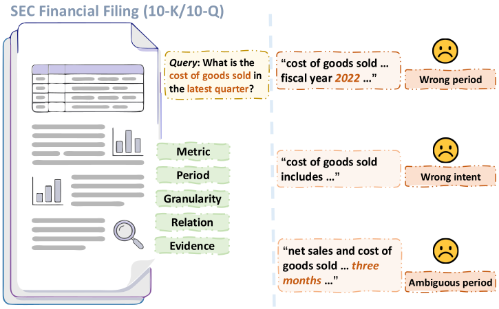
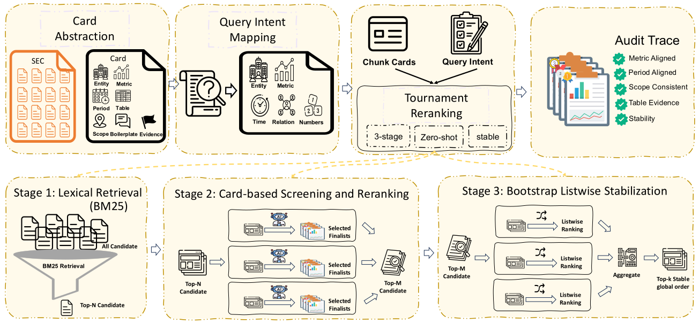

<div align="center">

# FINCARDS

**Card-Based Analyst Reranking for Financial Document Question Answering**

Yixi Zhou, Fan Zhang, Yu Chen, Haipeng Zhang, Preslav Nakov, and Zhuohan Xie

[](https://arxiv.org/abs/2601.06992)

FINCARDS turns long financial filings into structured evidence cards, then reranks
candidate chunks with explicit constraints over metrics, entities, periods, and
numeric evidence.

</div>

<p align="center">
  
</p>

## Overview

Financial QA over corporate filings is not just semantic search. A correct
evidence chunk often has to match the requested financial metric, fiscal period,
entity scope, and numeric signal at the same time. Generic rerankers can surface
text that is topically similar but wrong on one of those constraints.

**FINCARDS** reframes evidence selection as constraint-aware reranking:

- **Chunk Cards** expose finance-specific fields such as entities, metrics,
  periods, numeric spans, table cues, and section context.
- **Query Intents** map each question into the same structured space.
- **Tournament Reranking** screens, orders, and stabilizes candidates through
  card-based comparisons and aggregation.
- **Audit Traces** make the final ranking easier to inspect than a single
  monolithic long-context prompt.

<p align="center">
  
</p>

## Repository Contents

```text
.
|-- README.md
|-- requirements.txt
|-- pipeline/
|   |-- stage0_generate_cards.py        # Build structured Chunk Cards
|   |-- stage0_query_intent.py          # Map questions to structured intents
|   |-- stage1_lexical_bm25.py          # High-recall intra-document BM25 retrieval
|   |-- stage2_card_rerank.py           # Card-based candidate screening/reranking
|   `-- stage3_bootstrap_listwise.py    # Bootstrap listwise ranking and aggregation
`-- assets/
    |-- fincards-challenge.svg
    `-- fincards-pipeline.svg
```

## Pipeline

| Stage | Script | Purpose | Main outputs |
| --- | --- | --- | --- |
| 0a | `pipeline/stage0_generate_cards.py` | Generate structured Chunk Cards from filing chunks. | `chunk_cards.json`, progress JSON |
| 0b | `pipeline/stage0_query_intent.py` | Convert questions into structured financial intents. | `stage0_query_intents.jsonl` |
| 1 | `pipeline/stage1_lexical_bm25.py` | Retrieve high-recall candidates within each filing. | `stage1_candidates_detailed.jsonl`, `stage1_summary.json` |
| 2 | `pipeline/stage2_card_rerank.py` | Screen and rerank Stage 1 candidates using cards. | `stage2_results_detailed.jsonl`, intermediate trace, summary, CSV |
| 3 | `pipeline/stage3_bootstrap_listwise.py` | Stabilize ranking with bootstrap listwise aggregation. | `stage3_results_detailed.jsonl`, intermediate trace, summary, CSV |

## Quick Start

Create an environment and install the minimal dependencies:

```bash
python -m venv .venv
source .venv/bin/activate
pip install -r requirements.txt
```

Configure API access through environment variables. Do not commit real keys.

```bash
export OPENAI_API_KEY="<your-api-key>"
export OPENAI_MODEL_NAME="<model-name>"
```

For Stage 0 scripts that use OpenAI-compatible endpoints, you may also set:

```bash
export OPENAI_BASE_URL="https://api.openai.com/v1/"
```

## Expected Data Layout

The scripts are designed for a FinBenchQA-style layout. Generated data, benchmark
files, and model outputs are intentionally not tracked in this repository.

```text
../data/finbenchqa/filtered_data/
|-- questions.json
|-- unique_chunks.json
`-- chunk_cards.json or per-document card JSON files
```

Some paths are constants near the top of each script. If your local directory
layout differs, edit those constants before running the corresponding stage.

## Running

Run each stage from the repository root after preparing the expected inputs:

```bash
python pipeline/stage0_generate_cards.py
python pipeline/stage0_query_intent.py
python pipeline/stage1_lexical_bm25.py
python pipeline/stage2_card_rerank.py
python pipeline/stage3_bootstrap_listwise.py
```

Stage 1 is deterministic. Stages that call an LLM use deterministic decoding
where configured, but API-side behavior and bootstrap grouping can still affect
runtime and small ranking differences.

## Safety Notes

- Keep API keys in environment variables or a local `.env` file.
- Do not commit benchmark data, generated outputs, traces, or local experiment
  folders unless they are explicitly intended for release.
- Review generated card files before publishing because they may contain source
  document text from the underlying filings.
- This repository contains code only; paper sources, local paths, and private
  notes are not required to run the public pipeline.

## Citation

If you use FINCARDS, please cite the accompanying paper:

```bibtex
@misc{zhou2026fincardscardbasedanalystreranking,
  title = {FinCARDS: Card-Based Analyst Reranking for Financial Document Question Answering},
  author = {Yixi Zhou and Fan Zhang and Yu Chen and Haipeng Zhang and Preslav Nakov and Zhuohan Xie},
  year = {2026},
  eprint = {2601.06992},
  archivePrefix = {arXiv},
  primaryClass = {cs.IR},
  url = {https://arxiv.org/abs/2601.06992}
}
```
